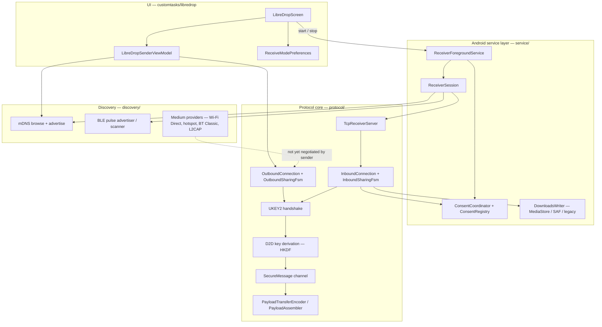

# LibreDrop

LibreDrop is Bao Translate's peer-to-peer file transfer feature. It speaks the Quick Share
(Nearby Connections) wire protocol directly — no Google Play Services dependency for the transfer
itself — so an Android device running this app can exchange files with another device over the
local network.

## ELI5

Two phones on the same Wi-Fi want to swap a file. One phone shouts "I'm here!" on the network
(mDNS). The other phone hears it and opens a direct connection. Before sending anything, the two
phones do a secret handshake so nobody else can read the file, and they each show the same 4-digit
number so you can check you're really talking to the right phone. The receiving person taps
Accept, then the file goes across in chunks and gets rebuilt on the other side.

## Status

| Half | State | Entry point |
| --- | --- | --- |
| Receive | Working | "Receive files" switch on the LibreDrop screen |
| Send over Wi-Fi LAN | Working | "Add" → pick files → "Scan" → pick a peer → "Send" |
| Send over Wi-Fi Direct / hotspot / Bluetooth | Not wired | Providers exist in `discovery/medium`; the sender does not yet negotiate a bandwidth upgrade |
| Consent trampoline activity | Working | `LibreDropConsentActivity` — foreground modal; heads-up notification actions remain the fallback |
| QR-bonded pairing | Code present, not surfaced | `protocol/qr` has no UI entry point |
| AI file descriptions / voice share | Code present, not surfaced | `FileMetadataTranslator`, `VoiceShareController`, `ShareConfirmationTts`, `LibreDropLlmInterface` have no callers |

The task description string still advertises "AI-powered file descriptions, voice commands, and
multilingual metadata". Those classes exist but nothing calls them; treat the description as
aspirational until they are wired.

### Measured dead surface

A reference audit over the real on-disk tree (every declared `class`/`object`/`interface` checked
for a reference outside its own file, Hilt- and manifest-wired types excluded by hand) puts
**2,865 lines of LibreDrop with zero callers** across 16 types:

| File | LOC | Why it is unreferenced |
| --- | --- | --- |
| `discovery/bootstrap/BleGattInitialControlClient.kt` | 748 | Sender-side BLE GATT bootstrap; the sender only opens Wi-Fi LAN. The *Server* counterpart is live. |
| `discovery/medium/BluetoothRfcommMediumProvider.kt` | 495 | Bandwidth-upgrade medium; the sender never negotiates an upgrade. |
| `discovery/bootstrap/BleL2capInitialControlClient.kt` | 416 | As above, LE CoC variant. Server counterpart is live. |
| `discovery/bootstrap/BluetoothClassicBootstrapServer.kt` | 297 | Bluetooth Classic bootstrap, not reached. |
| `protocol/connection/ResumeFrames.kt` | 204 | Resume protocol frames; resume is not driven from either half. |
| `discovery/bootstrap/BluetoothClassicBootstrapClient.kt` | 201 | As above. |
| `protocol/qr/QrUrl.kt` | 100 | QR pairing has no UI entry point. |
| `service/downloads/SaveLocationDisplayName.kt` | 73 | Save-location picker UI was never built. |
| `VoiceShareController.kt` | 68 | "Voice share" — no caller. |
| `LibreDropLlmInterface.kt` | 58 | "AI file descriptions" — no caller. |
| `FileMetadataTranslator.kt` | 55 | "Multilingual metadata" — no caller. |
| `ShareConfirmationTts.kt` | 49 | Spoken share confirmation; sibling of the trio above. |
| `discovery/medium/BadaMediumRegistries.kt` | 35 | Registry builder; the live path uses `MediumRegistries` directly. |
| `protocol/ProtocolInfo.kt` | 28 | Constant holder left from the multi-module layout this was ported from. |
| `service/receiver/ReceiverBugReportDiagnostics.kt` | 23 | Bug-report attachment helper; no reporting UI. |
| `service/ServiceModuleInfo.kt` | 15 | Module-name constant, same porting residue. |

This is kept, not deleted: each file implements a documented future path, and removing it would
throw away the work the unwired features need. The point of listing it is that the size is now
known rather than assumed.

Every entry above is zero-reference across `main/`, `test/` **and** `androidTest/`, and the list is
now enforced: `DeadSurfaceGuardTest` re-derives it on every unit-test run and fails if any further
production type becomes unreferenced. The last five rows were found by that test, not by the manual
sweep that produced the first eleven — which is precisely why it exists.

Outside LibreDrop the same sweep initially reported two orphans. Widening it past `main/` corrected
one of them:

- `customtasks/common/SteadinessMonitor.kt` (76 LOC) — genuinely zero references in every source
  set. A working sensor-based device-steadiness detector with no caller; it looks built for a
  capture-stabilisation path that was never wired.
- `common/AppError.kt` (66 LOC) — **not** an orphan. Zero production references, but two in
  `JsonCodecMigrationTest`, and its partner type `common/Outcome.kt` has four live production uses.
  This is a half-adopted abstraction (the result type landed and is used; the typed error hierarchy
  landed and has not been taken up yet), not dead code. Deleting it would remove the destination of
  an in-progress migration.

Neither is removed here. `SteadinessMonitor` is functioning, deliberately-written code whose
"integration" would mean inventing a capture feature; `AppError` is mid-migration. Both are listed
so the choice is explicit rather than invisible.

## Architecture



## Transfer sequence

```mermaid
sequenceDiagram
  participant S as Sender
  participant R as Receiver
  Note over R: "Receive files" ON → foreground service → TCP listener + mDNS advertise
  S->>R: mDNS browse resolves endpoint (address, port, EndpointInfo)
  S->>R: TCP connect
  S->>R: OfflineFrame{ConnectionRequest, endpoint_id, endpoint_info}
  S->>R: UKEY2 ClientInit
  R->>S: UKEY2 ServerInit
  S->>R: UKEY2 ClientFinished
  Note over S,R: Both derive D2D session keys (HKDF). Sender = CLIENT role, receiver = SERVER role.
  R->>S: OfflineFrame{ConnectionResponse}
  S->>R: OfflineFrame{ConnectionResponse, ACCEPT}
  Note over S,R: SecureMessage channel is live. Both compute the same 4-digit PIN from the auth string.
  S->>R: PairedKeyEncryption
  R->>S: PairedKeyEncryption
  S->>R: PairedKeyResult
  R->>S: PairedKeyResult
  S->>R: IntroductionFrame (file names, sizes, payload ids)
  Note over R: Consent notification posted; user taps Accept or Reject
  R->>S: ConnectionResponseFrame{ACCEPT}
  loop per 512 KiB chunk
    S->>R: PayloadTransferFrame{DATA}
  end
  S->>R: PayloadTransferFrame{LAST_CHUNK}
  R->>R: Assembler commits the destination
  S->>R: Disconnection
```

## Security properties

- **Encryption**: UKEY2 (X25519 + HKDF-SHA256) establishes a session; all post-handshake frames
  travel inside a SecureMessage envelope keyed by the derived D2D keys.
- **Role assignment is load-bearing.** The sender drove UKEY2, so it is `CLIENT` on the
  SecureMessage layer and encrypts with `clientEnc`/`clientHmac`. Swapping the roles produces two
  self-consistent halves that cannot decrypt each other. The loopback test exists specifically to
  catch this.
- **Channel binding**: both sides derive a 4-digit PIN from the UKEY2 auth string. The receiver
  shows it on the consent prompt. Equal PINs on both screens is the man-in-the-middle check.
- **Consent before bytes**: no destination is opened until `submitUserConsent(true)` has run. A
  rejected transfer opens nothing and commits nothing.
- **Attacker-controlled filenames** pass through `FilenameSanitizer` before touching MediaStore or
  a `File`. Path separators, control characters, NUL and leading dots are all neutralised, and
  `parent_folder` segments are split, sanitized and stripped of `.`/`..`.
- **Opt-in visibility**: the receiver never starts implicitly. `ReceiveModePreferences` defaults to
  off, and the switch is the only way to turn it on.

## Test coverage

| Suite | What it proves |
| --- | --- |
| `LibreDropLoopbackE2eTest` | Full stack over a real TCP socket on 127.0.0.1: handshake, key derivation, secure channel, FSMs, chunked payloads. Byte-exact round trip for 1 file, 3 files, a 1.5 MB multi-chunk payload and a 0-byte file; clean reject on both sides; both peers derive the same PIN. |
| `HkdfTest` | RFC 5869 Appendix A vectors (test cases 1–3), prefix property, domain separation, length bounds. |
| `PinDerivationTest` | Sign-extension contract, modulus wrap, format invariants, bit-flip sensitivity. |
| `FilenameSanitizerTest` | Path-traversal corpus invariants for filenames and relative paths. |
| `ByteRangeSetTest` | Resume coverage algebra, including a randomised model test against a boolean-array oracle. |
| `EndpointCodecTest` | EndpointInfo/TLV/Base64Url round trips, forward compatibility for unknown TLVs, and a 5,000-case fuzz asserting the pre-auth parser never throws. |
| `OutboundSharingFsmTest` | Transition table: out-of-order frames become protocol errors, cancel from every state, terminal absorption. |
| `ConsentIntentsTest` | Consent broadcast routing, including every case that must be dropped rather than actioned. |
| `UriFileSourceTest`, `LibreDropSenderViewModelMappingTest` | Pre-existing: URI-backed payload sourcing and connection-state → UI-state mapping. |

`LibreDropConsentActivityTest` covers the trampoline's defensive paths under Robolectric: a launch
with no connection id, with the sentinel id, and for an already-terminated transfer must each
finish without rendering and without leaking a `ConsentModalRegistry` entry. A consent card that
does not match a live inbound connection is worse than none — accepting it would submit a decision
into nothing while the user believes they authorised a transfer.

`ReceiveModePreferencesTest` runs under Robolectric against a real Android `SharedPreferences`,
asserting the privacy-relevant default (a fresh install is not discoverable) and the persistence
round-trip the screen relies on when it re-asserts the user's choice after a process death.

Two toolchain constraints came with adopting Robolectric, both handled in the build rather than
worked around in tests:

- Robolectric 4.16.1's bundled ASM cannot read Java 26 class files, so `tasks.withType<Test>` pins a
  JDK 21 launcher. Compilation still uses the JDK 26 toolchain and production bytecode still
  targets Java 17, so nothing about what is tested changes.
- Robolectric ships emulated frameworks up to SDK 36 while `targetSdk` is 37, so Robolectric tests
  carry an explicit `@Config(sdk = [36])` pin.

The pin is 4.16.1, the latest stable. 4.17-beta-2 was tested against both constraints: it *does*
accept `@Config(sdk = [37])`, but fails on JDK 21 **and** JDK 26 with
`RuntimeException: Failed to interact with raw FileDescriptor internals; perhaps JRE has changed?`,
so neither workaround can be dropped yet. Revisit at 4.17 stable.

Still not covered: the foreground-service lifecycle (`ReceiverForegroundService` is 1,451 lines and
drives real `BluetoothLeScanner` / `NsdManager` objects), BLE discovery, the Wi-Fi Direct and
hotspot medium providers, and the notification builders. Those need instrumentation on a device, or
a service refactor small enough to sit behind a Robolectric harness.

## Manual verification

The wiring was verified on an emulator (`system-images;android-35;default;arm64-v8a`):

1. Toggle "Receive files" → runtime permissions requested → `dumpsys activity services` shows
   `ReceiverForegroundService` with `isForeground=true types=0x00000010` (connectedDevice) and a
   persistent notification on channel `bada.receiver.foreground`.
2. Tap "Add" → the system document picker opens → selecting a file stages it with a localized size
   and a remove control.
3. The Send button label tracks state: "Select files and a device" → "Select a nearby device" →
   "Send to <peer>".
4. `LibreDropConsentActivity` launches `LAUNCH_SINGLE_TOP` with `isTopActivityTransparent=true`, and
   its stale-entry path (no live `ConsentRegistry` entry) logs and finishes cleanly, leaving 0
   references in the activity stack and 0 fatal exceptions. Its *happy* path — a live entry with
   Accept/Reject — needs a real peer and is not proven on-device yet.

A second device on the same network is required to exercise an actual transfer end-to-end; the
loopback test covers the protocol itself.

## Known gaps

- The consent trampoline's *happy* path (a live `ConsentRegistry` entry) needs a real peer to
  exercise; only the stale-entry path is proven on-device so far. See the verification note below.
- The sender advertises only Wi-Fi LAN in `ConnectionRequestFrame.mediums`
  (`MediumRegistry.DefaultWifiLan`). Bandwidth upgrade to a faster medium is not negotiated.
- `ReceiverForegroundService` (1,451 lines) and several protocol files exceed the repository's
  400-line file guard, so they cannot currently be edited in place without being split first.
